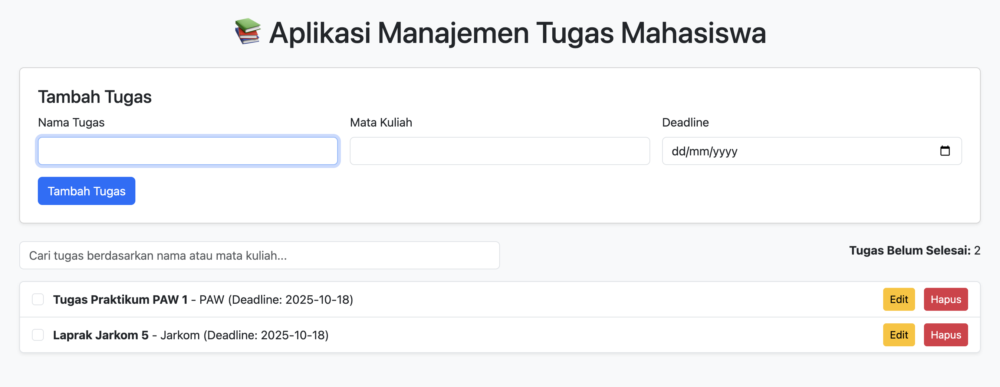

# 📚 Aplikasi Manajemen Tugas Mahasiswa

Aplikasi ini membantu mahasiswa dalam mengelola aktivitas akademik seperti tugas kuliah dengan fitur lengkap berbasis web dan penyimpanan lokal.

## 🎯 Fitur Utama
- ✅ Tambah tugas baru dengan informasi:
  - Nama Tugas
  - Mata Kuliah
  - Deadline
- ✏️ Edit tugas yang sudah ada
- ✔️ Tandai tugas sebagai **selesai/belum selesai**
- ❌ Hapus tugas
- 🔍 Filter/pencarian tugas berdasarkan nama atau mata kuliah
- 📊 Menampilkan jumlah tugas yang **belum selesai**
- 🧩 Validasi input form (tidak boleh kosong, tanggal wajib diisi)
- 💾 Penyimpanan data menggunakan **localStorage**

## ⚙️ Teknologi
- HTML5  
- CSS (Bootstrap 5)  
- JavaScript (DOM & localStorage)

## 📁 Struktur File
- index.html -> Tampilan utama aplikasi
- script.js -> Logika aplikasi dan pengelolaan data
- readme.md -> Dokumentasi aplikasi


## 🚀 Cara Menjalankan
1. Unduh semua file ke dalam satu folder.
2. Buka file `index.html` menggunakan browser (Chrome, Edge, atau Firefox).
3. Aplikasi siap digunakan tanpa perlu server tambahan!

## 💾 Penggunaan localStorage
- Data disimpan dengan key `tasks`.
- Menyimpan menggunakan:
  ```js
  localStorage.setItem('tasks', JSON.stringify(arrayTasks));
  ```

- Mengambil data:
  ```js
  JSON.parse(localStorage.getItem('tasks'));

  ```
- Data tersimpan secara persisten di browser meskipun halaman ditutup.


🖼️ Screenshot Website


