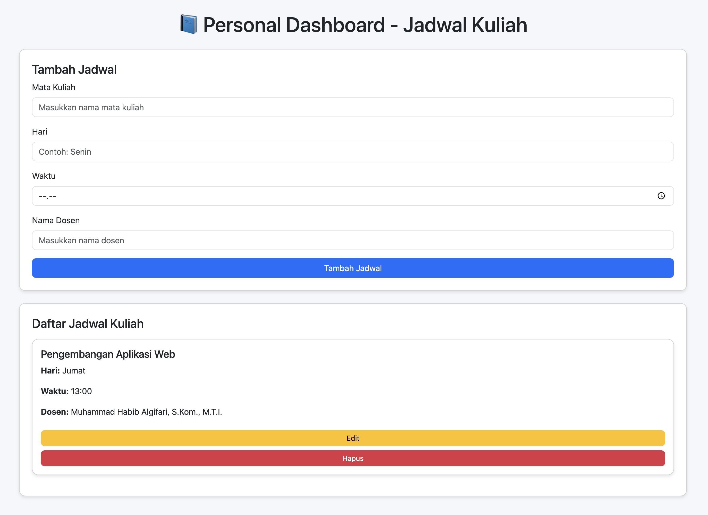

# Personal Dashboard — Jadwal Kuliah

Aplikasi sederhana: **Personal Dashboard** untuk menampilkan & mengelola jadwal kuliah.  
Data disimpan di `localStorage` sehingga persist di browser.
# 📘 Personal Dashboard - Jadwal Kuliah

Aplikasi **Personal Dashboard Jadwal Kuliah** ini membantu mahasiswa mengatur jadwal kuliah secara mudah dan interaktif.  
Data disimpan secara **lokal menggunakan `localStorage`**, sehingga tetap tersimpan meski halaman direfresh.

---

## 🎯 Fitur Aplikasi
- Menambahkan jadwal kuliah baru (mata kuliah, hari, waktu, nama dosen)
- Mengedit jadwal yang sudah ada
- Menghapus jadwal
- Data tersimpan otomatis di `localStorage`
- Tampilan sederhana dan responsif (Bootstrap 5)

---

## 🧩 Fitur ES6+ yang Diimplementasikan
- **`let` dan `const`** digunakan secara tepat
- **3 Arrow Function**:
  - `saveToLocalStorage`
  - `renderSchedules`
  - `deleteSchedule`
- **Template Literals** untuk menampilkan data dinamis
- **Async/Await** digunakan pada `showNotification()`
- **Class** digunakan untuk mendefinisikan struktur `Schedule`

---

## ⚙️ Cara Menjalankan
1. Unduh semua file (`index.html`, `script.js`, `README.md`)
2. Pastikan semuanya berada dalam satu folder
3. Buka file `index.html` di browser
4. Tambahkan jadwal kuliah sesuai kebutuhan

---

## 🖼️ Screenshot (Contoh)


---

## 💾 Penjelasan LocalStorage
- Data jadwal disimpan dalam array `schedules`
- Disimpan ke localStorage dengan:
  ```js
  localStorage.setItem('schedules', JSON.stringify(schedules));
